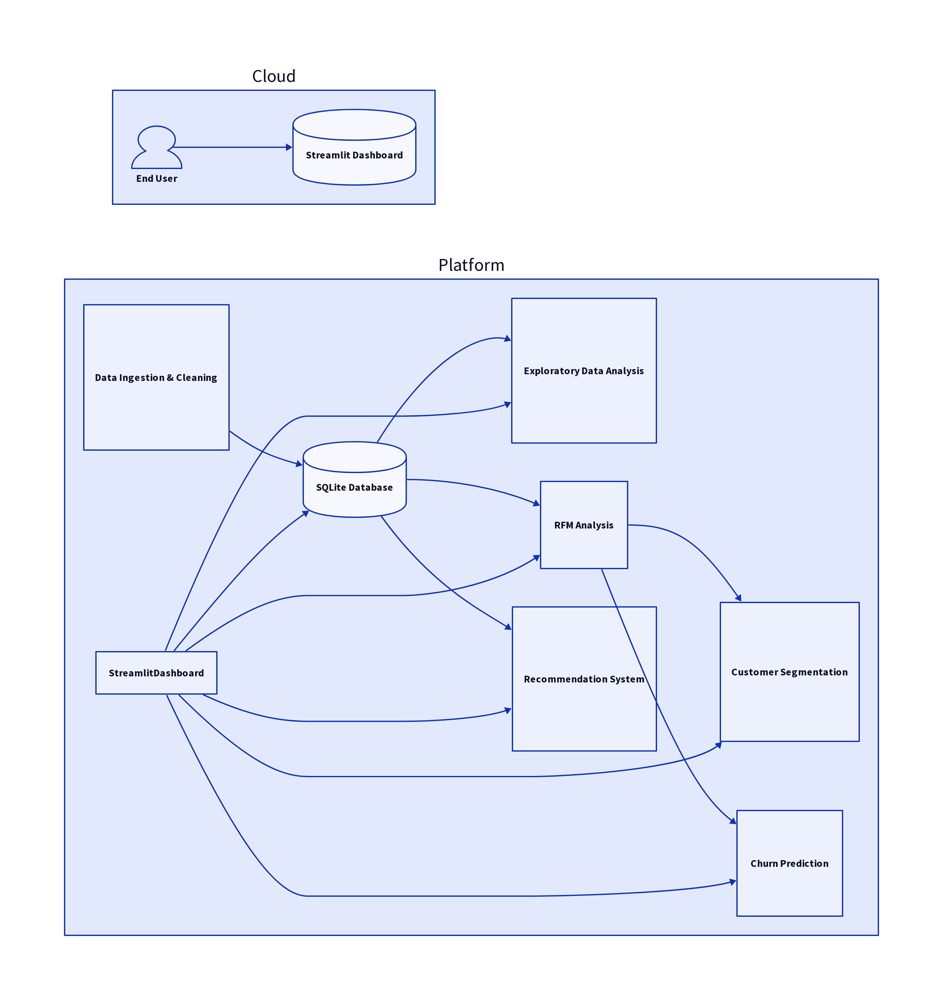

# CommerceIntel Analytics Platform – E-commerce Recommendation & Customer Segmentation

## Project Overview

CommerceIntel is a comprehensive, end-to-end analytics platform designed for e-commerce businesses. It leverages data science and machine learning to provide actionable insights into customer behavior, product performance, and sales trends. The platform includes modules for data cleaning, exploratory data analysis (EDA), SQL database management, RFM (Recency, Frequency, Monetary) analysis, customer segmentation using K-Means clustering, a collaborative filtering recommendation system, and a churn prediction model. All insights are presented through an interactive Streamlit dashboard.

## Features

*   **Data Ingestion & Cleaning**: Automated process to download, clean, and preprocess raw e-commerce transactional data.
*   **SQL Database**: SQLite database for structured storage of customer, product, order, and transaction data.
*   **Exploratory Data Analysis (EDA)**: Visualizations for key metrics such as revenue trends, top products, top customers, and purchase frequency.
*   **RFM Analysis**: Calculation of Recency, Frequency, and Monetary scores to segment customers into actionable groups (e.g., Champions, Loyal Customers, At Risk).
*   **Customer Segmentation**: K-Means clustering to identify distinct customer segments based on their purchasing behavior.
*   **Recommendation System**: Collaborative filtering to provide personalized product recommendations.
*   **Churn Prediction**: Machine learning model (Random Forest) to predict customer churn, along with feature importance and confusion matrix analysis.
*   **Interactive Dashboard**: A Streamlit-based web application for visualizing all analytics, segments, recommendations, and churn predictions.
*   **Unit Testing**: Comprehensive unit tests for core modules (RFM, Segmentation, Recommendation) to ensure data integrity and model accuracy.
*   **Deployment Ready**: Includes `requirements.txt`, `.gitignore`, and detailed instructions for local setup and deployment.

## Architecture Diagram



## Project Screenshots

*   **Dashboard Overview**: 
*   **Sales Analytics**: 
*   **Customer Segments**: 
*   **Recommendations**: 
*   **Churn Prediction**: 

## Installation and Setup

1.  **Clone the repository**:
    ```bash
    git clone https://github.com/your-username/CommerceIntel.git
    cd CommerceIntel
    ```

2.  **Create a virtual environment** (recommended):
    ```bash
    python -m venv venv
    source venv/bin/activate  # On Windows: .\venv\Scripts\activate
    ```

3.  **Install dependencies**:
    ```bash
    pip install -r requirements.txt
    ```

4.  **Run the data processing pipeline**:
    This will download the dataset, clean it, populate the SQLite database, perform EDA, RFM analysis, segmentation, and train ML models.
    ```bash
    python src/data_cleaning.py
    python src/database_manager.py
    python src/eda.py
    python src/rfm_analysis.py
    python src/segmentation.py
    python src/recommender.py
    python src/churn_prediction.py
    ```

5.  **Run the Streamlit Dashboard**:
    ```bash
    streamlit run dashboard/app.py
    ```
    The dashboard will open in your web browser, typically at `http://localhost:8501`.

## Future Enhancements

*   **Advanced Recommendation Algorithms**: Implement matrix factorization (e.g., SVD, ALS) or deep learning-based recommendation models.
*   **Real-time Analytics**: Integrate with a streaming data platform (e.g., Kafka, Flink) for real-time data processing and dashboard updates.
*   **A/B Testing Framework**: Develop a framework to A/B test different recommendation strategies or marketing campaigns.
*   **Deployment to Cloud**: Deploy the entire platform to a cloud provider (AWS, GCP, Azure) using services like Docker, Kubernetes, and managed databases.
*   **More Sophisticated Churn Definition**: Incorporate more features and a time-series approach for churn prediction.
*   **User Authentication**: Add user authentication and authorization to the Streamlit dashboard.

## Contributing

Contributions are welcome! Please fork the repository and submit pull requests.

## License

This project is licensed under the MIT License.

## Contact

For any inquiries, please contact [Your Name/Email/LinkedIn].
