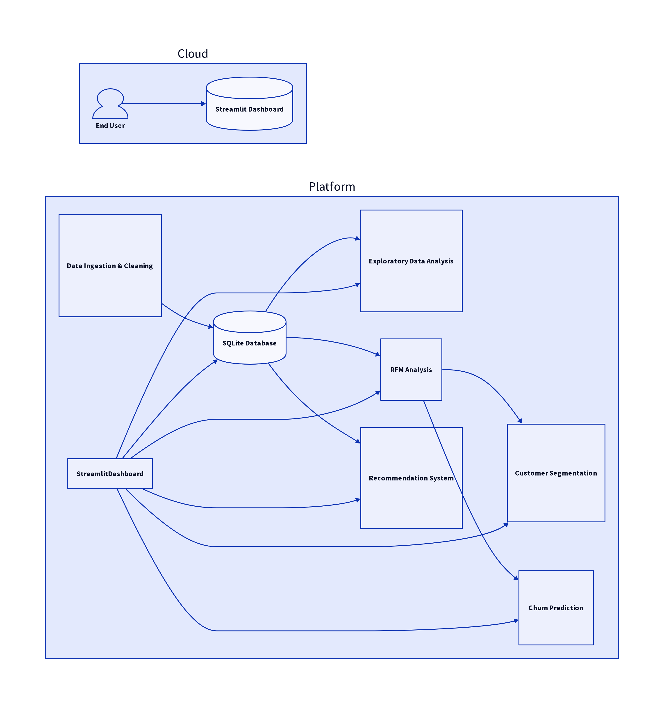

# 🚀 CommerceIntel Analytics Platform

### End-to-End E-commerce Analytics, Customer Segmentation & Recommendation System

CommerceIntel is a comprehensive **Machine Learning-powered E-commerce Analytics Platform** that helps businesses analyze customer behavior, monitor sales performance, generate personalized product recommendations, and predict customer churn through an interactive Streamlit dashboard.

<p align="center">
  
</p>

---

# 📌 Project Overview

CommerceIntel combines **Data Engineering, Machine Learning, and Business Intelligence** into a single platform.

The project automates the complete analytics pipeline—from data ingestion and preprocessing to customer segmentation, recommendation generation, churn prediction, and interactive dashboard visualization.

The platform enables businesses to:

- 📈 Monitor sales performance
- 👥 Understand customer behavior
- 🎯 Recommend personalized products
- ⚠️ Predict customer churn
- 📊 Make data-driven business decisions

---

# 🛠 Tech Stack

| Category | Technologies |
|-----------|--------------|
| Language | Python |
| Dashboard | Streamlit |
| Data Analysis | Pandas, NumPy |
| Visualization | Plotly |
| Machine Learning | Scikit-Learn |
| Database | SQLite |
| Testing | Pytest |
| Version Control | Git & GitHub |

---

# ✨ Features

### 📊 Sales Analytics
- Revenue Analysis
- Monthly Sales Trends
- Order Analysis
- Top Products
- Top Customers
- Country-wise Filtering
- Category Filtering

---

### 👥 Customer Segmentation

- RFM (Recency, Frequency, Monetary) Analysis
- Customer Ranking
- K-Means Clustering
- Segment Distribution
- Interactive Scatter Plots
- Customer Segment Table

---

### 🎯 Product Recommendation System

- Collaborative Filtering
- Personalized Recommendations
- Hybrid Recommendation Pipeline
- Customer-based Product Suggestions
- Top-N Product Recommendations

---

### 📉 Customer Churn Prediction

- Random Forest Classifier
- Churn Probability Prediction
- Customer Risk Analysis
- High Risk Customer Detection
- Churn Distribution Visualization

---

### ⚙️ Data Pipeline

- Automated Data Cleaning
- Feature Engineering
- SQLite Database
- Exploratory Data Analysis (EDA)
- Model Training
- Data Validation
- Unit Testing

---

# 🏗 System Architecture

<p align="center">
  
</p>

---

# 🔄 Project Workflow

```text
Raw E-commerce Dataset
          │
          ▼
Data Cleaning & Preprocessing
          │
          ▼
SQLite Database
          │
          ▼
Exploratory Data Analysis (EDA)
          │
 ┌────────┴─────────┐
 │                  │
 ▼                  ▼
RFM Analysis    Recommendation System
 │                  │
 ▼                  │
Customer Segmentation
 │
 ▼
Churn Prediction
 │
 ▼
Interactive Streamlit Dashboard
```

---

# 🤖 Machine Learning Models

| Module | Algorithm |
|----------|------------|
| Customer Segmentation | K-Means Clustering |
| Customer Analysis | RFM Analysis |
| Recommendation System | Collaborative Filtering |
| Churn Prediction | Random Forest |

---

# 📷 Dashboard Screenshots

## 📊 Dashboard Overview

<p align="center">

</p>

---

## 📈 Sales Analytics

<p align="center">

</p>

---

## 👥 Customer Segmentation

<p align="center">

</p>

---

## 🎯 Product Recommendation System

<p align="center">

</p>

---

## 📉 Customer Churn Prediction

<p align="center">

</p>

---

# 📂 Project Structure

```text
CommerceIntel/
│
├── dashboard/
│   └── app.py
│
├── src/
│   ├── data_cleaning.py
│   ├── database_manager.py
│   ├── eda.py
│   ├── rfm_analysis.py
│   ├── segmentation.py
│   ├── recommender.py
│   └── churn_prediction.py
│
├── database/
├── data/
├── docs/
├── models/
├── notebooks/
├── tests/
├── README.md
├── requirements.txt
└── run_pipeline.py
```

---

# ⚡ Installation

## Clone Repository

```bash
git clone https://github.com/Worksarvesh/CommerceIntel.git

cd CommerceIntel
```

---

## Create Virtual Environment

### Windows

```bash
python -m venv venv

.\venv\Scripts\activate
```

### Linux / Mac

```bash
python -m venv venv

source venv/bin/activate
```

---

## Install Dependencies

```bash
pip install -r requirements.txt
```

---

## Run Complete Data Pipeline

```bash
python run_pipeline.py
```

---

## Launch Dashboard

```bash
streamlit run dashboard/app.py
```

Open your browser:

```
http://localhost:8501
```

---

# ✅ Unit Testing

Run all tests

```bash
pytest
```

---

# 🚀 Future Improvements

- Deep Learning Recommendation Models
- Matrix Factorization (SVD / ALS)
- Real-time Data Streaming
- Docker Support
- Kubernetes Deployment
- AWS/GCP Deployment
- User Authentication
- REST API Integration
- Model Monitoring
- Automated Retraining Pipeline

---

# 📬 Contact

**Sarvesh Sharma**

📧 Email: **worksarvesh05@gmail.com**

💼 LinkedIn: https://www.linkedin.com/in/worksarvesh/

🐙 GitHub: https://github.com/Worksarvesh

---

# ⭐ Support

If you found this project useful, consider giving it a ⭐ on GitHub!

It motivates me to continue building more Machine Learning and Data Engineering projects.
