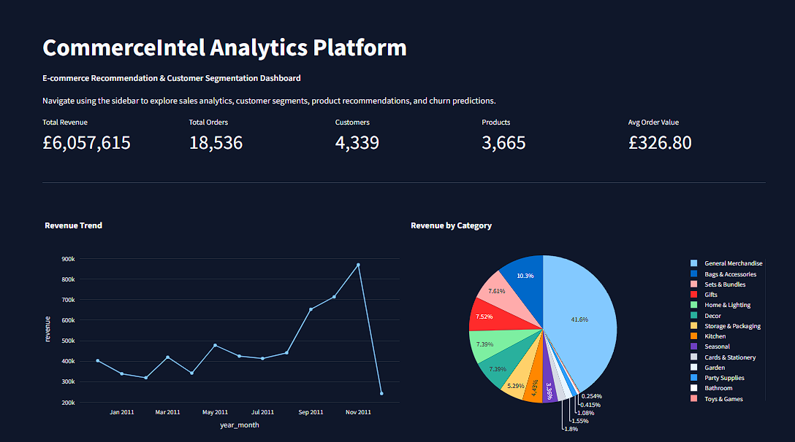
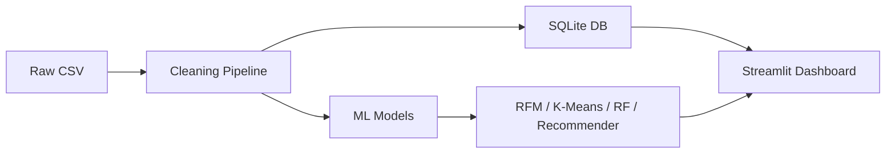

# CommerceIntel Analytics Platform

**E-commerce Recommendation & Customer Segmentation** — a production-ready, end-to-end data science platform built with Python 3.11+.


---

## Overview

CommerceIntel transforms raw e-commerce transaction data into actionable business intelligence:

- **Data Engineering** — cleaning, feature engineering, SQLite warehousing
- **Customer Analytics** — RFM scoring and K-Means segmentation
- **Recommendations** — hybrid collaborative + content-based filtering
- **Churn Prediction** — Random Forest classifier with feature importance
- **Interactive Dashboard** — Streamlit app with KPIs, filters, and search

> **Dataset:** [Online Retail (UCI)](https://www.kaggle.com/datasets/carrie1/ecommerce-data) — 541,909 transactions from a UK-based online gift retailer (2010–2011).

<!-- Replace with actual screenshot after running dashboard -->
<!--  -->

---

## Architecture


```mermaid
flowchart LR
    A[Raw CSV] --> B[Cleaning Pipeline]
    B --> C[SQLite DB]
    B --> D[ML Models]
    D --> E[RFM / K-Means / RF / Recommender]
    C --> F[Streamlit Dashboard]
    E --> F
```

See [docs/ARCHITECTURE.md](docs/ARCHITECTURE.md) for detailed module design.

---

## Features

| Module | Capability |
|--------|------------|
| Data Cleaning | Missing values, duplicates, dtype correction, IQR outlier capping |
| EDA | Revenue trends, monthly sales, top products/customers, CLV |
| SQL Analytics | Normalized schema with 8+ analytical queries |
| RFM Analysis | 5-segment customer labels (Champions, At Risk, Lost, etc.) |
| Segmentation | K-Means with elbow method and business recommendations |
| Recommendations | Collaborative, content-based, and hybrid Top-N engine |
| Churn ML | Random Forest with confusion matrix and feature importance |
| Dashboard | 5 Streamlit pages with interactive Plotly charts |
| Testing | pytest unit tests for RFM, segmentation, recommendations |

---

## Project Structure

```text
commerceintel-analytics/
├── data/
│   ├── raw/                  # Kaggle CSV
│   ├── processed/            # Cleaned datasets
│   └── outputs/              # EDA/ML artifacts
├── database/
│   ├── schema.sql
│   ├── queries.sql
│   └── commerceintel.db      # Generated
├── src/
│   ├── data/                 # Loader, cleaner, features
│   ├── analysis/             # EDA, RFM
│   ├── db/                   # SQLite connection & ETL
│   ├── ml/                   # Segmentation, recommendations, churn
│   └── pipeline.py
├── dashboard/
│   ├── app.py
│   └── pages/
├── notebooks/
├── tests/
├── docs/
├── models/
├── run_pipeline.py
└── requirements.txt
```

---

## Installation (Windows / VS Code)

```powershell
cd commerceintel-analytics
python -m venv venv
.\venv\Scripts\Activate.ps1
pip install -r requirements.txt
```

### Kaggle API Setup (optional — data may already exist in `data/raw/`)

1. Create API token at [kaggle.com/settings](https://www.kaggle.com/settings)
2. Save `kaggle.json` to `C:\Users\<username>\.kaggle\kaggle.json`

---

## Run Commands

### 1. Execute Full Pipeline

```powershell
python run_pipeline.py
```

With Kaggle download:

```powershell
python run_pipeline.py --download
```

### 2. Launch Dashboard

```powershell
streamlit run dashboard/app.py
```

Open `http://localhost:8501`

### 3. Run Tests

```powershell
pytest -v
```

### 4. Explore Notebook

```powershell
jupyter notebook notebooks/01_eda_analysis.ipynb
```

---

## Dashboard Pages

1. **Overview** — KPIs, revenue trend, category breakdown
2. **Sales Analytics** — filters, search, top products/customers
3. **Customer Segments** — RFM + K-Means visualizations
4. **Recommendations** — hybrid engine with method selector
5. **Churn Prediction** — probability distribution, risk bands, high-risk list

---

## Deployment

### Local Production Run

```powershell
python run_pipeline.py
streamlit run dashboard/app.py --server.port 8501
```

### Streamlit Cloud

1. Push repo to GitHub
2. Connect at [share.streamlit.io](https://share.streamlit.io)
3. Set main file: `dashboard/app.py`
4. Add pipeline artifacts or run pipeline in `packages.txt`/startup script

### Docker (optional extension)

```dockerfile
FROM python:3.11-slim
WORKDIR /app
COPY requirements.txt .
RUN pip install -r requirements.txt
COPY . .
RUN python run_pipeline.py
EXPOSE 8501
CMD ["streamlit", "run", "dashboard/app.py", "--server.address", "0.0.0.0"]
```

---

## Key Results

After pipeline execution, review `data/outputs/pipeline_report.json` for:

- Cleaning statistics
- EDA summary metrics
- Segmentation cluster counts
- Churn model accuracy / F1
- Database row counts

---

## Future Enhancements

- [ ] FastAPI microservice for real-time recommendations
- [ ] Airflow DAG for scheduled retraining
- [ ] PostgreSQL + dbt analytics layer
- [ ] MLflow model registry
- [ ] A/B testing framework for recommendation strategies
- [ ] Docker Compose + GitHub Actions CI

---

## Documentation

- [Dataset Selection & Columns](docs/DATASET.md)
- [Architecture Diagram](docs/ARCHITECTURE.md)
- [Resume & Interview Guide](docs/RESUME.md)

---

## License

MIT License — suitable for portfolio and educational use.

---

## Author

Built as a resume-worthy end-to-end data science portfolio project demonstrating data engineering, machine learning, and full-stack analytics delivery.
