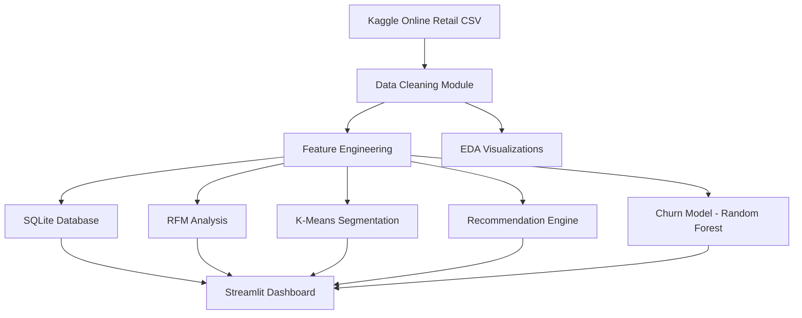

# Architecture Documentation

## System Overview



## Module Responsibilities

| Module | Path | Responsibility |
|--------|------|----------------|
| Data Loader | `src/data/loader.py` | Kaggle download, CSV ingestion |
| Data Cleaner | `src/data/cleaner.py` | Missing values, duplicates, outliers |
| Feature Engineering | `src/data/feature_engineering.py` | Customer/product aggregates |
| EDA | `src/analysis/eda.py` | Matplotlib + Plotly visualizations |
| RFM | `src/analysis/rfm.py` | Recency, Frequency, Monetary scoring |
| Database | `src/db/` | SQLite schema, ETL, analytical queries |
| Segmentation | `src/ml/segmentation.py` | K-Means + elbow method |
| Recommendations | `src/ml/recommendation.py` | Collaborative + content-based hybrid |
| Churn | `src/ml/churn.py` | Random Forest classifier |
| Pipeline | `src/pipeline.py` | Orchestrates end-to-end execution |
| Dashboard | `dashboard/` | Streamlit multi-page UI |

## Database Schema

- **customers** – customer profile and lifetime aggregates
- **products** – product catalog with sales metrics
- **orders** – order-level totals and dates
- **transactions** – line-item level facts

## Deployment Topology

```text
Local Development (Windows)
├── Python 3.11+
├── SQLite file database
├── Joblib model artifacts
└── Streamlit local server (port 8501)
```

## Future Enhancements

- FastAPI REST layer for recommendation and churn scoring
- Airflow/Prefect scheduled pipeline runs
- PostgreSQL migration for production scale
- MLflow experiment tracking
- Docker + CI/CD with GitHub Actions
